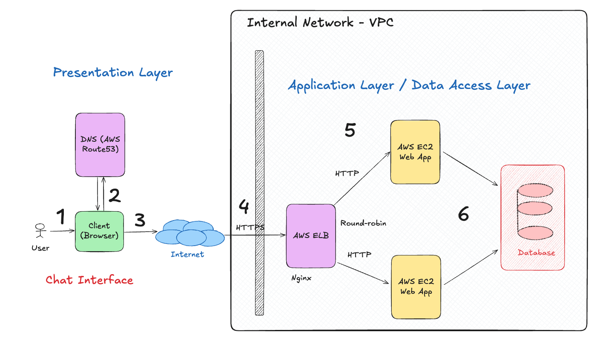

# Ship Infra Project

---

## title: Ship Infrastructure - A Hands-On Terraform Journey Through AWS

Infrastructure as Code is now a core skill for modern software engineers. Whether you're deploying a simple service or scaling a production system, you need infrastructure that is consistent, repeatable, and version-controlled. Terraform makes that possible.

I originally came from a frontend-heavy background, and my first steps into AWS were through the console - clicking around, creating resources manually, and forgetting how I did it the next day. Terraform changed everything. It gave me a way to understand AWS through code, build mental models slowly, and create infrastructure I could share and reuse.

## What you'll build



In this guide, we'll build a simple yet complete web application infrastructure on AWS using Terraform. We will build what is called a three-tier application, as in the diagram above. The three tiers are:

1. **Presentation Tier**: This is the front door to your application. We'll set up an EC2 instance with a web server, assign it a static IP using Elastic IP, and map a domain name to it using Route53. We'll also enable HTTPS using API Gateway and a Load Balancer.
2. **Application Tier**: This is where your application logic lives. In this guide, our EC2 instance will serve as both the web server and application server, running a simple web app that connects to the database.
3. **Data Tier**: This is where your data is stored. We'll provision a managed PostgreSQL database using RDS and securely store database credentials using Secrets Manager.

At the end of this guide, you will have Terraform code that provisions the following outputs:

```sh
domain_for_your_apps=
ip_address_of_your_ec2_instance_one=
ip_address_of_your_ec2_instance_two=
database_endpoint=
```

The above outputs represent a fully functional web application infrastructure on AWS, all provisioned with Terraform. Specifically, you will learn how to:

- Launch an [EC2](https://docs.aws.amazon.com/ec2/) instance inside your VPC
- Assign a static IP with [Elastic IP](https://docs.aws.amazon.com/AWSEC2/latest/UserGuide/elastic-ip-addresses-eip.html)
- Add a domain with [Route53](https://docs.aws.amazon.com/Route53/latest/DeveloperGuide/Welcome.html)
- Enable HTTPS through [API Gateway](https://docs.aws.amazon.com/apigateway/latest/developerguide/welcome.html) and [Load Balancer](https://docs.aws.amazon.com/elasticloadbalancing/latest/userguide/what-is-load-balancing.html)
- Store secrets safely with [Secrets Manager](https://docs.aws.amazon.com/secretsmanager/latest/userguide/intro.html)
- Setup a Database with [RDS](https://docs.aws.amazon.com/AmazonRDS/latest/UserGuide/Welcome.html)

By the end, you'll have a clear picture of how AWS pieces fit together and how Terraform can manage them cleanly.

Let's start from the basics and grow toward production: one file at a time.

## What this tutorial is not

We are providing bare bones infrastructure for typical 3 layer application. This is not a tutorial on how to build secure, scalable, production ready infra. There are many more aspects to consider like monitoring, logging, autoscaling, backups, disaster recovery and so on. The goal here is to get you familiar with the core concepts of AWS and Terraform so you can build upon them.

## Acknowledgements

This guide was inspired by my own journey learning AWS and Terraform as a frontend developer. Special thanks to the Terraform and AWS communities for their excellent documentation and examples that made this possible.

Throughout this guide, I am using the [Infragram](https://marketplace.visualstudio.com/items?itemName=infragram.infragram) VS Code extension to render diagrams directly from code comments. It helps visualize infrastructure components and their relationships, making it easier to understand complex setups. It is open source and free and is very reliable!

Feel free to reach out on [@LinkedIn](https://www.linkedin.com/in/viktor-vasylkovskyi-708b1712b/) if you have any questions or feedback!
